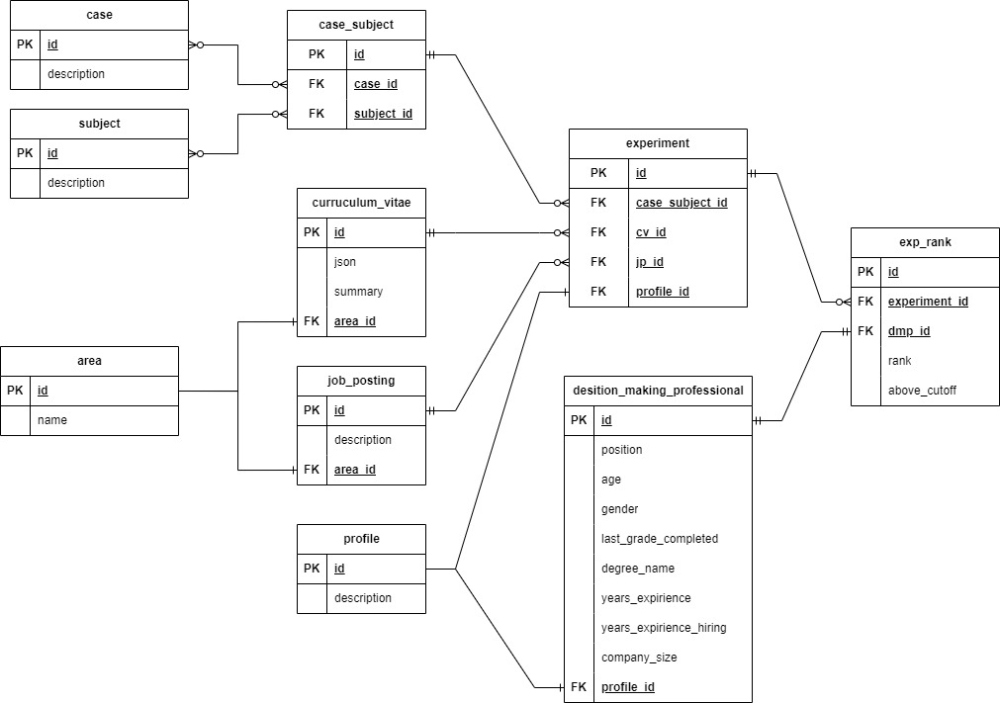

# Empirical Based Job Matching Model using Expert Human Knowledge: A Mixed-Methods Approach

The overarching goal of this research was to, using resumes and job descriptions, design a system that enables the classification of candidates and job positions in software development and data science-related areas as suitable or not suitable. This was achieved by identifying and modeling recruitment processes conducted by hiring personnel, for application in the automatic profiling of personnel. 

## Content

- *1_instruments_eval*: this folder contains the JSON and LaTeX versions of the instruments for the evaluation experiment. 
- *2_fuzzymeasuredata*: this folder contains the measures that defined the regular fuzzy measure $\mu$ used in the Choquet integration. Also, contains the job seniority weights $W_j$, $W_m$, $W_s$.
- *3_db_eval_and_query*: this folder contains the rankings and ranking cutoffs of the CVs made by the experiment's participants and the general metadata associated with each participant in a database format. Special Python functions are provided to query this database.
- *4_train_test_set*: this folder contains the CV and job description dataset used during the training of the Siamese network. Each dataset includes its table schema.

### 1_instruments_eval description

The instruments are grouped using the set's names *Greece*, *Trees*, *Constellations*, *Fruits*. Each set contains six associated CVs. For instance, inside *Greece* folder there are the Delta, Kappa, Lambda, Sigma, Omega, and Tau CVs. The LaTeX version of the sets was made using a modified version [Clean Resume Template](https://www.overleaf.com/latex/templates/clean-resume/xnndrgfhyjzg) by Vinayak Sharma on Overleaf. The ''Present'' in the CVs refers to November of 2023.

### 2_fuzzymeasuredata description

It contains two Excel files. The FSpace_PowerSet_Measure.xlsx file has the definition of the regular fuzzy measure $\mu$, and SenorityLevelsWeights.xlsx contains the job seniority weights junior ($W_j$), mid-level ($W_m$), and senior or higher ($W_s$).

### 3_db_eval_and_query description

Three files are included in the 3_db_eval_and_query folder. The first one is hlp_ranking_experiment.db, this was created in python using SQLite3, and contains the experiment information as can be seen in the ER diagram. The second file SQLite-ExampleQueries is a jupyter notebook with some examples of the database usage. The Third file contains a dictionary of all tables, explaning the meaning of each column.

<p align="center">

</p>

#### Example cell:
```python
# Assuming that a connection is established above
# The IDs you want to search for
decision_making_professional_id = 14
case_id = 'Greece'

# SQL query using placeholders for parameters
sql_query = """
SELECT er.*, cs.case_id, cs.subject_id
FROM exp_rank er
JOIN experiment e ON er.experiment_id = e.id
JOIN case_subject cs ON e.case_subject_id = cs.id
JOIN decision_making_professional dmp ON er.dmp_id = dmp.id
WHERE cs.case_id = ? AND dmp.id = ?;
"""
# Define your query with parameters
parameters = (case_id, decision_making_professional_id)
# Execute the query and fetch the result into a DataFrame
df = pd.read_sql_query(sql_query, conn, params=parameters)
```
#### Result:
| id | experiment_id | dmp_id | rank | above_cutoff | case_id | subject_id |
|--------------:|-------:|-----:|-------------:|--------:|-----------:|--------|
|             1 |      1 |   14 |            5 |       1 |     Greece |  Delta |
|             2 |      2 |   14 |            2 |       1 |     Greece |  Kappa |
|             3 |      3 |   14 |            3 |       1 |     Greece | Lambda |
|            4 |      4 |   14 |            1 |       1 |     Greece |  Sigma |
|            5 |      5 |   14 |            4 |       1 |     Greece |  Omega |
|            6 |      6 |   14 |            6 |       1 |     Greece |    Tau |


## Contact

For any queries, suggestions, or clarifications regarding these resources, you can contact the authors through the following means:

María Elena

- 📧 Email: 
  - malena.mzn@outlook.com
  - a214200821@unison.mx
- 🔗 [LinkedIn](https://www.linkedin.com/in/malenamanzanares/)

Jordan Joel

- 🔗 [LinkedIn](https://www.linkedin.com/in/jordan-joel-urias-paramo/)


### About the authors

- María Elena Martínez-Manzanares has a Bachelor's Degree in Mathematics obtained in 2018 from the Universidad de Sonora (Mexico), and a Bachelor's Degree in Mathematics Education obtained in 2023 from the Universidad Abierta y a Distancia de México. In 2019 she obtained an MSc in Mathematics from the Universidad de Sonora. Currently, she is finishing a Ph.D. at Universidad de Sonora, focusing her work on the stochastic control area. She is close to concluding her second MSc in Data Science at the same university with a focus on the NLP area. She has research experience on Markovian and semi-Markovian theoretical models and problems using mixed methods in different areas of applied mathematics and mathematics education. She worked as a data scientist in the telematics sector.
- Jordan Joel Urias Paramo has a Bachelor's Degree in Computer Science, obtained in 2019 from the Universidad de Sonora (Mexico). He currently works as a data engineer and is a Data Science Master's Degree student at the Universidad de Sonora.
- Julio Waissman-Vilanova has a Ph.D. in Automatic Systems from the Institut National Polytechnique de Toulouse (France). He is a full professor at Universidad de Sonora, Mexico, and his current research interests include Image Processing, Pattern Recognition and NLP.
- Gudelia Figueroa-Preciado has a Ph.D. in Mathematics from the Universidad de Sonora (Mexico). She is a full professor at Universidad de Sonora, Mexico, and her current research interests include 

## Acknowledgments

We want to acknowledge the following people for their valuable contributions to this work: 
- Ph.D. Cipriano Arturo Santos-Borbolla and MBA Francisco Enrique Andrade-López from the Operations Artificial Intelligence group (Oper.ai) at the Instituto Tecnológico y de Estudios Superiores de Monterrey (Mexico);
- Evelyn Mercedes Medina-García from the Master's Program in Social Sciences at the Universidad de Sonora (Mexico);
- Ph.D. Ramón Soto de la Cruz and Francisco Alejandro Bernal-Cañez from the Department of Mathematics at the Universidad de Sonora (Mexico);
- M.Sc. Irenisolina Antelo-López from the Doctoral Program in Sciences with a specialization in Educational Mathematics at the Universidad de Sonora (Mexico);
- Computer Scientist, Luis Fernando Sotomayor-Samaniego.

Thank you for your interest in this research.


